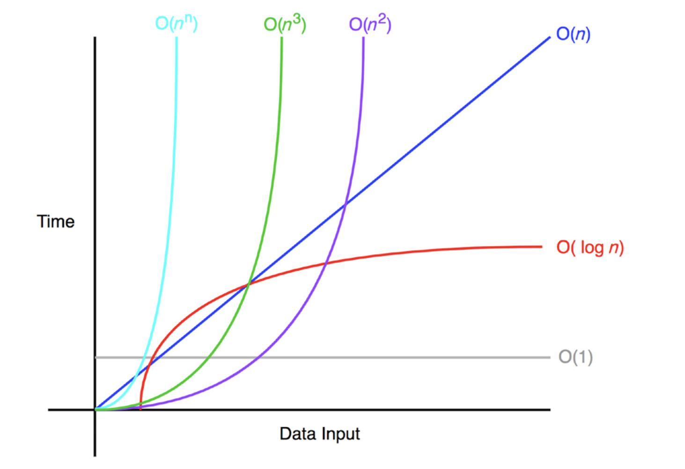

# Binary Search

### BST Intro:

A binary tree is just a any tree, where we have a constraint on the number of children each node can have. 

In a binary tree, that constraint is that each node can only have a maximum of two children. Options are zero, one, or two children.

A binary search tree adds an additional layer of structure/constraint on top of the tree. 

```js
// Searching through a sorted array.
[apple, fence, ghost, jackal, just, money, mystic, nerd, pencil, zebra]
```
Using binary search on a SORTED array (E.G Searching for pencil), time complexity is O(log n). Why is that? Answer: We cut out half the array each time.

However, inserting into this array is inefficient. 
Analogy. Inserting "booyah" into the array vs inserting "booyah" into the dictionary.

We could use binary search to find where to insert "booyah"
We would find the right spot, for inserting, in roughly O(log n).

Using an array to store information, if we just wanna check what's in there, is great. But if we wanna add new information in (keeping array sorted), an array is not efficient O(n) linear time.

💪 You do! Take a minute to figure out how this BST is sorted. (2 minutes)💪


The whole advantage of this tree is the following:
1. It's very easy to find a value. E.G Find ghost O(log(n)) operation
2. Inserting is always A LOT faster. We don't have to shift over anything. 

##### Binary Search Tree
- Also a tree, made of nodes
- But each node has a left and right child
- Has a "rule" for arrangement (Main difference between a binary tree and a binary search tree)
- Often used for fast searching and keeping sorted data sorted.
- Insertion is also faster than inserting into a sorted array.

💪 You do! Take a minute to figure out how this BST is sorted. (1 minutes)💪


We're not just limited to numbers and words. We can use this BST for colors E.G lighter shades vs darker shades. Basically, anything you can make a comparison of.

The motivation behind BST is that they are a very FAST structure to keep sorted data with the following attributes: 
1. adding data in
2. retreiving sorted data.

### BST Class: Implementing BSTs

Node Class:
Node class is the same as any other binary Node class:
```js
class Node {
  constructor(val, left=null, right=null) {
    this.val = val;
    this.left = left;
    this.right = right;
  }
  // other methods here
}
```
Suppose we want to implement the following tree:

```js
class Node {
  constructor(val, left=null, right=null) {
    this.val = val;
    this.left = left;
    this.right = right;
  }
}
// Making all of my nodes first here.
const E = new Node('E')
const A = new Node('A')
const B = new Node('B')
const C = new Node('C')
const D = new Node('D')
const F = new Node('F')
const G = new Node('G')

// Connecting the nodes here:
E.left = B;
E.right = G;
B.left = A;
B.right = D;
G.left = F;

console.log(E);
```

Above, we're making all the nodes separately and connecting them manually. It feels like busy work for Kenjamin. 🤬

FYI: We may not ALWAYS need class for tree. However, it is useful for keeping track of root of tree.

Creating Binary Search Tree Class
All we need is that root top most node
```js
class Node {
  constructor(val, left=null, right=null) {
    this.val = val;
    this.left = left;
    this.right = right;
  }
}

// Creating Binary Search Tree Class
// All we need is that root top most node
class BinarySearchTree {
  constructor(root=null) {
    this.root = root;
  }
}


// Making all of my nodes first here.
const E = new Node('E')
const A = new Node('A')
const B = new Node('B')
const C = new Node('C')
const D = new Node('D')
const F = new Node('F')
const G = new Node('G')

// Connecting the nodes here:
E.left = B;
E.right = G;
B.left = A;
B.right = D;
G.left = F;

// Making this a tree now
const tree = new BinarySearchTree(E);
console.log(tree);
```
Copy and paste the above code in a Google Chrome console to visualize our tree.

### Searching a BST
Is 53 in this BST? 

Is Larry Bird (#33) in this BST?

The above only took 3 comparisons to figure out that Larry Bird #33 is not in our tree (a total of 13 elements).

```js
class Node {
  constructor(val, left=null, right=null) {
    this.val = val;
    this.left = left;
    this.right = right;
  }
  find(sought) {
    let currentNode = this;
    while(currentNode) {
      // Let's take a look at each node we're visiting with our find method.
      console.log("VISITING: ", currentNode.val)
      if (currentNode.val === sought) return currentNode;
      if (currentNode.val > sought) {
        currentNode = currentNode.left
      } else {
        currentNode = currentNode.right;
      }
    }
  }
}

// Creating Binary Search Tree Class
// All we need is that root top most node
class BinarySearchTree {
  constructor(root=null) {
    this.root = root;
  }
}

// Making all of my nodes first here.
const E = new Node('E')
const A = new Node('A')
const B = new Node('B')
const C = new Node('C')
const D = new Node('D')
const F = new Node('F')
const G = new Node('G')

// Connecting the nodes here:
E.left = B;
E.right = G;
B.left = A;
B.right = D;
G.left = F;

// Making this a tree now
const tree = new BinarySearchTree(E);
console.log(E.find('A')); // Node { val: 'A', left: null, right: null }
console.log(E.find('J')); // undefined
```

### BST Search Runtime:
How does our Binary Search Tree perform? What is our Big O runtime? 
Every time we make a choice (between left or right), we reduce our # of options by half.

Runtime is O(log n) for search (at MOST/Worst Case Scenario). 
E.G: 
We can search > 1,000 nodes in only 10 steps!
We can search > 1,000,000 nodes in only 20 steps!

Searching within a BST is its bread and butter. 
Big takeaway - Binary Search is very fast at searching. The End.



### Balancing a BST:

### Traversing a BST:

### Hashmaps vs BST: